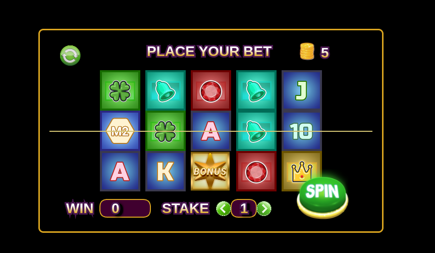

# slots-challenge

Create a slot prototype which is 5 reels wide and 3 symbols tall using any game
framework or rendering engine that you like (for example PixiJS, Phaser, Cocos
Creator, etc..) using either Typescript or Javascript

1. Use the assets given to link them to the symbols in the game
2. The preferred slot game is a ways type that pays left to right but using regular winlines
which pay left to right is also accepted
3. Include a simple spin button that either spins or drops the symbols on the reels one
after another
4. The symbols should be randomized on every spin
5. The symbols should pay out a value (>0) when three or more of a kind are formed on
the reels
6. The win amount should be clearly visible
7. Use any pay table values you like
8. Use any math rng you like

Keep the game very simple as long as it is fully playable: multiple spins are
possible and every spin is evaluated correctly for win ways.

Also think about creating a structure that is easily extendable, for example if you would have to
change the board size or add extra features like free spins or bonus rounds in the future.



# Approach

## First approach
Since this is my first encounter with PixiJS, I started knowing about it by reading teh [Getting started](https://pixijs.com/8.x/guides/basics/getting-started) doccumentation page and some entries of the [API Documentation](https://pixijs.download/release/docs/app.Application.html). With these I was already familiar with some of the core concepts, like creating an Application, importing assets, handling update loops.

I was also able to find a basic example of slot reels in the PixiJS [Slots Example](https://pixijs.com/8.x/examples/advanced/slots) page. I did borrow some logic from here, especially for the tweening, lerp and backout functions, as well as some update loop logic and dimensions.

## Pay Logic
I also had to research about slots, since I realized I was not really familiar with paytables or paylines. Since I am not so versed yet on PixiJS, and am not exactly aware of its potential and limitiations, I decided to fetch the result of each spin using a custom collision detection function. I leverage the golden bar sprite I added for the center of the slots to use as collision point, and render a matrix of the final sprites.

This matrix is then filtered in order to find how many of these sprites are consecutive within the expected paylines, starting from the leftmost part of each payline. If the chain of sprites is broken, the payline does not take into account any combinations down the rest of the payline, since they need to match left to right.

> [!NOTE]
> The above is how I understood the concept of left to right paylines and paytables, might not be totally accurate but the aim is to explain the coded behavior

### Paylines

#### Horizontal Paylines (3)
```
    [K][K][K][K][K]  [ ][ ][ ][ ][ ]  [ ][ ][ ][ ][ ]
    [ ][ ][ ][ ][ ]  [K][K][K][K][K]  [ ][ ][ ][ ][ ]
    [ ][ ][ ][ ][ ]  [ ][ ][ ][ ][ ]  [K][K][K][K][K]
```

#### Diagonal Paylines (2)
```
    [ ][ ][ ][K][K]  [K][K][ ][ ][ ]
    [ ][ ][K][ ][ ]  [ ][ ][K][ ][ ]
    [K][K][ ][ ][ ]  [ ][ ][ ][K][K]
```

#### v Paylines (2)
```
    [K][ ][ ][ ][K]  [ ][ ][K][ ][ ]
    [ ][K][ ][K][ ]  [ ][K][ ][K][ ]
    [ ][ ][K][ ][ ]  [K][ ][ ][ ][K]
```

### Paytable

| SHAPE                     | X3    | X4    | X5    |
| ------------------------  | ----- | ----- | ----- |
| J, Q, K, 1, H1, H2        | 5     | 10    | 25    |
| 9, 10, M1, M2, M3, M4, M5 | 1     | 3     | 5     |
| H4                        | 7     | 15    | 40    |
| H5                        | 8     | 20    | 50    |
| H6                        | 10    | 25    | 60    |
| H3                        | 25    | 60    | 120   |
| BONUS                     | 50    | 200   | 250   |


> [!NOTE]
> I got inspiration from several paytables examples around the internet, however since this one had lots of symbols, low prizes are more common
